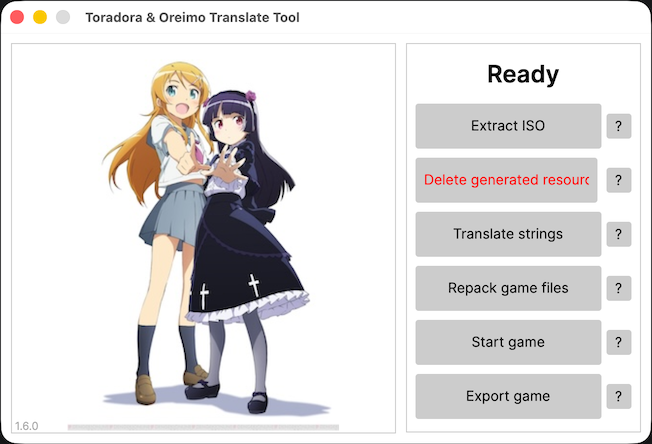
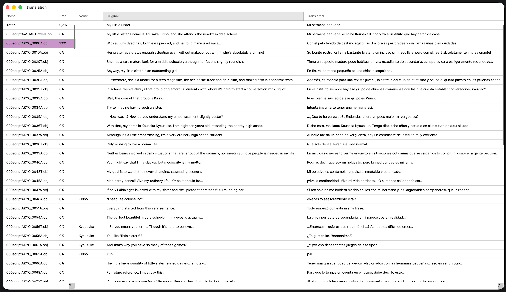

# FastAsyncToradoraTranslateTool

Name inspired by the [FastAsyncWorldEdit](https://www.spigotmc.org/resources/fastasyncworldedit.13932/) Minecraft mod, This fork improves the original project by increasing performance of the application.

### Improvements upon the base project
- Added a progress bar for iso extracting
- Improved game file extraction time by 1,848.80 %!
  - old time 274548 ms vs new time 14088 ms
- Improved game file repacking time by 2,037.40 %!
  - old time 189438 ms vs new time 8863 ms
- Reworked file structure! Allows you to easily delete all generated resources
- **Ported GUI to Avalonia** (OreimoTranslateToolAvalonia) for native macOS support
- **Extended CLI** with macOS support and new standalone options

### Why?

I was interested! I love the thought of optimizing something that takes a long time.

This is mostly just practice for me to be able to optimize and work with other people's projects.

The intention is also to speed up enough to be able to mess with game files and rebuild to test the changes in a reasonable time bracket

### Project

With this program you will be able to extract ISO, extract game files, translate all the text inside the game, and then repack it all.

## How do I translate the game?

All you need is the game's ISO file. You can use the original Japanese version, or already patched (except if it's patched by this app).

After you got the ISO file, you can choose between:

### Option 1: GUI (Avalonia - Cross-platform)

Open the Avalonia GUI application (OreimoTranslateToolAvalonia), which works on Windows, macOS, and Linux. The interface guides you through each step with help buttons explaining each section.

### Option 2: CLI (Command-line - Standalone)

Use the CLI tool (OreimoTranslateToolCLI) for scripting and automation. The CLI has been extended with macOS support and offers standalone options for headless operation.

### Translation Process

Start with the first stage. Next to each step there is a button with a question mark, when you click on it, you will get all the necessary information.

The instruction on the images translation is written in Resources/HowTo.txt.

You can automatically insert line breaks into the current file or all files at once through the context menu. But if you need to move the text to a new line manually, insert the symbol Fullwidth Low Line - "＿".

To add a new phrase, you must write it in square brackets in the phrase after which you want to insert the new phrase. For example, "First phrase\[Second phrase\]".  
To remove a phrase, you must write "\[DEL\]" in it. For example, "Unnecessary phrase\[DEL\]"

## Start game button?

A small utility to quickly run repacked files and test changes instead of waiting for iso repacking and stuff.

Use the config file `GameStart.conf` in the data folder to change the executable and args

Executable goes on line 1 and args go on line 2.

__The path of the unpacked iso folder would be appended to the args line at launch__

Example available [here](https://github.com/computer-catt/FastAsyncToradoraTranslateTool/blob/master/StartGame.conf)

If you are using the example make sure to change the paths and include the ppsspp config file

## Repacking iso file
The implementation in the application is platform specific. 

You need to have access to `mkisofs`, a utility from cdrtools.

If you get an exception repacking the application, you need to either add mkisofs to path or put the executable path into the `mkisofs.conf` file alongside the application executable.

if you cant find one for windows there's one sketchy one included in this repository in ToradoraTranslateTool/mkisofs, best of luck.

for arch you have to run `pacman -S cdrtools` to install because its cool.

## Features

- ISO extracting and repacking
- Extracting and repacking of all game files
- Extracting and importing of strings
- Calculation of translation percentage
- Automatic line break insertion
- Enabling game debug mode, where you can teleport to any level
- Ability to remove/add phrases in dialogs
- Ability to set up a start program to quickly test game changes

## Special thanks

- [Xyzz](https://github.com/xyzz) for their [taiga-aisaka tools](https://github.com/xyzz/taiga-aisaka)

- [Marcus André](https://github.com/marcussacana) for their [Toradora! Portable tools](https://github.com/marcussacana/Specific-Games)

- [IchinichiQ](https://github.com/IchinichiQ) for their [original project](https://github.com/IchinichiQ/ToradoraTranslateTool)

- [Marcus André](https://github.com/marcussacana) again for their help regarding their tools

- [computer-catt](https://github.com/computer-catt) for the [FastAsyncToradoraTranslateTool](https://github.com/computer-catt/FastAsyncToradoraTranslateTool) optimization improvements

- You! Thanks for reading even if you don't plan on using the software. :3

## Screenshots



## macOS Support

This tool has been adapted to work natively on macOS with both GUI and CLI options:

### GUI (Avalonia - OreimoTranslateToolAvalonia)

The original GUI has been ported to Avalonia, providing a native cross-platform experience on macOS, Windows, and Linux.

### CLI (OreimoTranslateToolCLI)

The CLI tool has been extended with full macOS support and new standalone options for automation and scripting.

### Prerequisites for macOS

1. **Install required tools:**
   ```bash
   brew install cdrtools
   ```

2. **Install .NET 8.0 SDK:**
   ```bash
   brew install --cask dotnet-sdk
   ```

3. **Make scripts executable:**
   ```bash
   chmod +x Resources/!!Tools/DatWorker/gzip
   ```

### Building for macOS

```bash
# Restore packages
dotnet restore

# Build the complete solution
dotnet build -c Release

# Or build just the GUI (Avalonia)
dotnet build OreimoTranslateToolAvalonia -c Release

# Or build just the CLI
dotnet build OreimoTranslateToolCLI -c Release
```

### Running on macOS

```bash
# Run the GUI (Avalonia)
dotnet run --project OreimoTranslateToolAvalonia

# Or run the CLI
dotnet run --project OreimoTranslateToolCLI
```

### Platform-specific Implementation

- **GUI**: Avalonia framework provides native macOS integration
- **CLI**: Extended with macOS-specific standalone options
- `mkisofs.conf`: Contains the path to mkisofs executable (default: `mkisofs`)
- `DatWorker/macOS/`: Contains macOS-specific implementations
- `Resources/!!Tools/DatWorker/gzip`: Shell script wrapper for macOS gzip

### Differences from Windows Version

- Uses native macOS tools (gzip, mkisofs) instead of Windows executables
- Platform-specific conditional compilation for CppPorts
- Native file dialogs via Avalonia on GUI, standard dialogs on CLI
- No dependency on Windows CRT (msvcp110d.dll, msvcr110d.dll)
